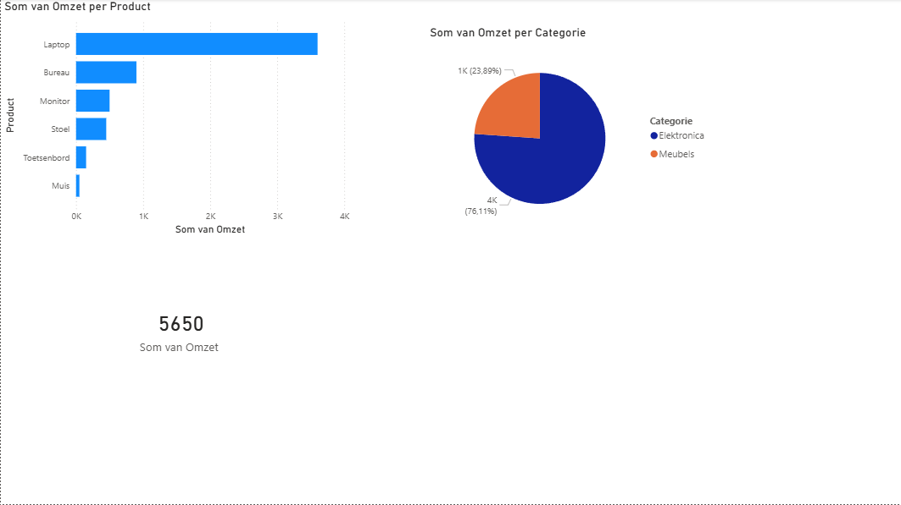

# Project 1: Sales Dashboard (Power BI)

## 🎯 Doel van het project
Het doel van dit project is het transformeren van verkoopdata naar een interactief en visueel dashboard. Hiermee kan een bedrijf in één oogopslag zien wat de totale omzet is, welke productcategorieën het best presteren en welke individuele producten de meeste omzet genereren.

## 📊 Het Dashboard
 

## 🛠️ Gebruikte Technologieën
* **Power BI Desktop** (Data visualisatie & Rapportage)
* **Microsoft Excel** (Data opslag & Bronbestand)

## 📈 Belangrijkste Inzichten uit de Data
1. **Totale Omzet**: De totale gegenereerde omzet over de gemeten periode in januari 2026 bedraagt **€ 5.650,-**.
2. **Top Categorie**: De categorie **Elektronica** is veruit de grootste omzetdrager in vergelijking met Meubels.
3. **Best Verkopende Product**: De **Laptop** zorgt voor de hoogste individuele omzetpieken (€ 3.600,- van de totale omzet).

## 🗂️ Bestanden in deze repository
* `sales_data.xlsx`: Het originele Excel-bronbestand met de transacties.
* `Sales_Dashboard.pbix`: Het Power BI-bestand inclusief het datamodel en de visualisaties.

---
*Dit project is gemaakt als onderdeel van mijn voorbereiding op het Make IT Work omscholingstraject voor Data & Analytics.*
